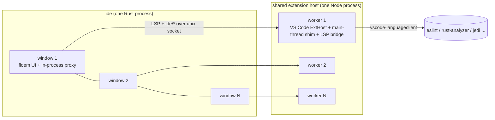

# Spike: a native, low-memory, VS Code–compatible IDE

## Problem

On a 24 GB laptop you need one editor window per agent worktree. VS Code costs about 800 MB per window once its
renderer, extension host and helpers are counted. Measured with 8 windows on 8 worktrees of `microsoft/vscode`:
**6.4 GB** with no extensions installed (`docs/spike-measurements.md`).

## Options evaluated

| Option | License | 8-window RSS | Extension compat | Verdict |
|---|---|---|---|---|
| VS Code (Electron) | MIT (OSS) / proprietary build | 6441 MB | native | baseline; too heavy |
| VS Code workbench in WKWebView (Tauri/wry) | MIT | not measured; JS workbench heap per window remains [INFERENCE] | native | drops Chromium only; still a JS UI per window |
| Rewrite from scratch in Rust | — | — | — | years of work; reuse beats rewrite |
| Zed (GPUI) | editor crates **GPL-3.0**, GPUI Apache-2.0 | 420 MB | none (own WASM ext API) | fails the permissive-license constraint |
| GPUI + gpui-component (Longbridge) | Apache-2.0 | n/a (toolkit, no editor) | none | would need a full editor built on top |
| **Lapce fork (floem/wgpu)** | **Apache-2.0** (+ floem MIT) | **437 MB** (ide fork, 8 real windows) | none (WASI plugins) | **chosen base** |

Lapce already has everything required in each window: file explorer, fuzzy palette (nucleo), tree-sitter syntax,
ripgrep-library project search, git2 source control with a file-watcher-driven diff, alacritty terminal, an LSP/DAP client,
and multiple windows in one process. Its deny.toml already bans GPL dependencies.

## Architecture

- **UI**: Lapce fork, renamed `ide`. `ide <folder>` opens a new **window** in the running instance (upstream opened a
  tab). One process, one in-process proxy per window.
- **Extensions**: VS Code's own extension host (MIT, built from source) running unchanged in Node `worker_threads`,
  one worker per window inside **one** Node process. A TypeScript main-thread shim implements the `MainThread*` RPC
  shapes. It reuses VS Code's `RPCProtocol` so wire ids always match.
- **Bridge as a language server**: each worker exposes its extensions to the Rust side as a standard **LSP server** on
  a unix socket. Lapce's existing LSP client then shows extension diagnostics, hovers, completions, definitions,
  formatting and code actions with no new UI code. Things LSP cannot express (status bar, webviews, tree views,
  decorations, the command list) travel as `ide/*` custom messages on the same connection.
- **Webviews** (Claude Code, GitLens): native WKWebView child views (`ide-webview` crate). They serve
  `vscode-resource.vscode-cdn.net` URIs from local roots and inject an `acquireVsCodeApi()` shim.

## Keep / drop

| Keep | Drop |
|---|---|
| VS Code extension host + `vscode` API (via shim) | Electron, Chromium renderer per window |
| VS Code keybindings (default preset + `keybindings.json` import) | Settings Sync |
| VS Code color themes (JSON) and TextMate grammars | Telemetry (VS Code's and Lapce's update checker) |
| LSP / DAP | Marketplace UI (extensions come from Open VSX; Microsoft Marketplace terms forbid non-Microsoft clients) |
| Lapce: tree-sitter, git, terminal, search, palette | Lapce WASI plugin registry as the primary extension path (kept working, not required) |

## Risks

- Extension memory multiplies per window: each worker loads its own copy of every activated extension. If the 8-window
  number misses the target, use a single multi-root extension host (all worktrees as folders of one workspace). That
  loads each extension once and routes per-window views.
- Webview-heavy extensions depend on many MainThread shapes. Any that need an Electron-only API are listed in
  `DEFERRED.md`.
- Pylance and the Microsoft Marketplace are proprietary and restricted to Microsoft products. We use Open VSX builds
  and Jedi for Python.
